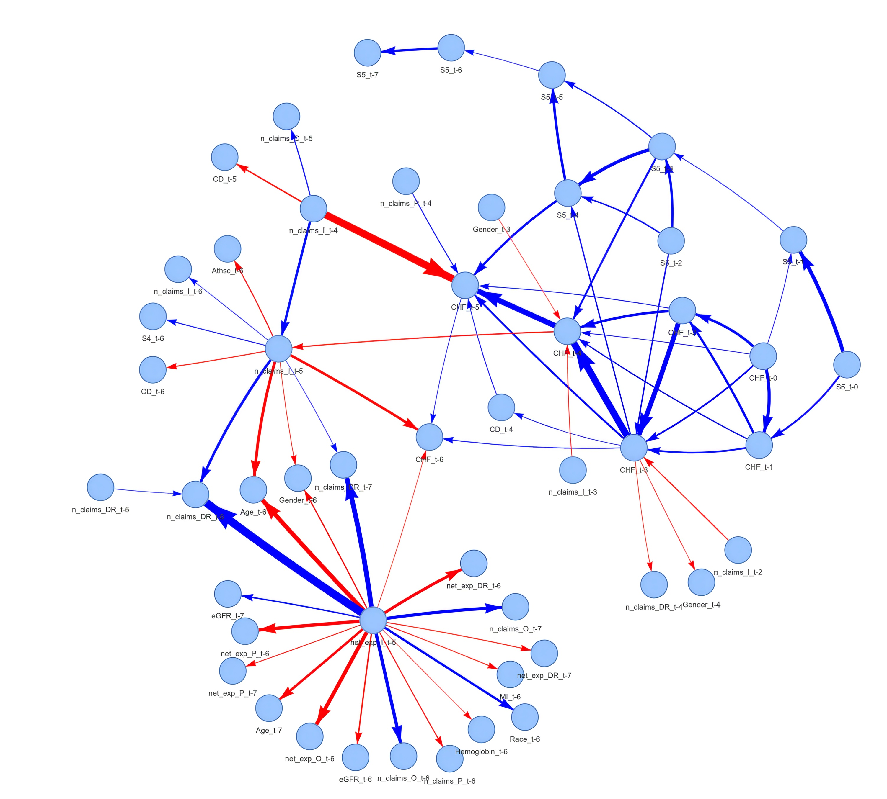
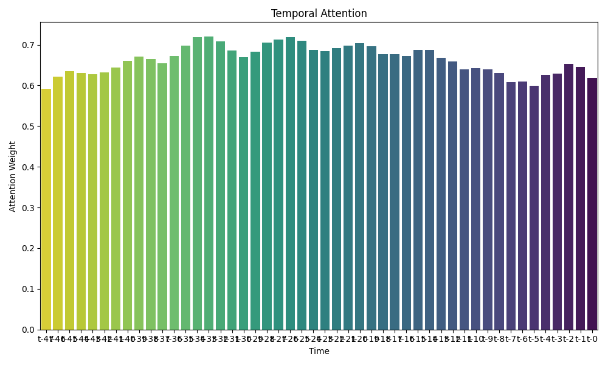

# Chain-of-Influence: Tracing Interdependencies Across Time and Features in Clinical Predictive Modeling

[](https://www.python.org/downloads/)
[](https://pytorch.org/)
[](LICENSE)

A novel interpretable deep learning framework for clinical time series prediction that explicitly models temporal-feature interdependencies. This repository contains the implementation for the AAAI 2026 submission.

## 🎯 Overview

Chain-of-Influence (CoI) addresses the critical gap in clinical predictive modeling by capturing how features influence each other across time. Unlike traditional approaches that treat features independently, CoI provides unprecedented transparency into the complex chains of influence that drive clinical outcomes.

<div align="center">
  
  <p><em>Chain-of-Influence network showing temporal-feature interdependencies in CKD progression. Node size reflects feature importance, arrow thickness indicates influence strength, and colors distinguish influence types.</em></p>
</div>

### Key Features

- **🔗 Explicit Influence Modeling**: Traces how feature A at time t affects feature B at time t+k
- **🎯 Multi-level Attention**: Combines temporal attention with cross-feature interactions
- **📊 Comprehensive Interpretability**: Provides feature importance and influence chain analysis
- **🎮 Interactive Demo**: Try the model instantly with our Google Colab notebook
- **⚖️ Data Balancing**: Novel Temporal SMOTE (TSMOTE) for time series class imbalance
- **🏥 Clinical Validation**: Evaluated on CKD progression and ICU mortality prediction

## 🏗️ Repository Structure

```
├── src/                          # Source code
│   ├── models/                   # Model implementations
│   │   ├── bilstm.py            # Bidirectional LSTM baseline
│   │   ├── retain.py            # RETAIN attention model
│   │   └── coi.py               # Chain-of-Influence model
│   ├── data/                    # Data processing utilities
│   │   ├── preprocess.py        # Data preprocessing
│   │   └── tsmote.py            # Temporal SMOTE implementation
│   └── utils/                   # Utility functions
│       └── report_best_model.py # Model reporting utilities
├── scripts/                     # Training and analysis scripts
│   ├── train.py                 # Model training script
│   ├── analyze.py               # Model analysis and visualization
│   └── preprocess_mimiciv.py    # MIMIC-IV preprocessing
├── config/                      # Configuration files
│   ├── coi_config.yaml          # CoI model configuration
│   ├── retain_config.yaml       # RETAIN model configuration
│   ├── bilstm_config.yaml       # BiLSTM model configuration
│   ├── mimiciv_*.yaml          # MIMIC-IV specific configs
│   └── feature_names.yaml      # Feature specifications
├── assets/                      # Visual assets
│   └── images/                  # Figures and visualizations
│       ├── influence_network.png # Chain-of-Influence network
│       └── temporal_attention_comparison.png
├── demos/                       # Interactive demonstrations
│   ├── colab/                   # Google Colab notebooks  
│   │   ├── demo.ipynb          # Complete interactive demo
│   │   └── sample_influence_matrix.csv # Test data
│   └── README.md               # Demo documentation
├── docs/                        # Documentation and paper
│   ├── Chain_of_Influence_AAAI_2026.tex
│   ├── appendix.tex
│   ├── references.bib
│   └── paper_visualization_guide.md
├── data/                        # Data directory (see data/README.md)
│   └── README.md               # Data acquisition instructions
└── results/                     # Experimental results
    ├── mimic/                   # MIMIC-IV results
    └── ckd/                     # CKD results
```

## 🚀 Quick Start

### 🎮 **Interactive Demo (Try Now!)**

[](https://colab.research.google.com/github/your-username/your-repo-name/blob/main/demos/colab/demo.ipynb)

**Experience Chain-of-Influence instantly in your browser!** No installation required - just click and explore:
- 📁 **Drag-and-drop file upload** for your influence matrices
- 🌐 **Interactive network visualization** with physics-based layouts  
- 🤖 **AI-powered analysis** using GPT-4 for pattern recognition
- 📊 **Professional dashboard** with 6 comprehensive tabs
- 🎯 **Sample data included** - test immediately with clinical examples

*Zero setup, maximum insight - explore temporal-feature relationships in seconds!*

### 💻 **For Developers & Researchers**

Want to train your own models or reproduce our results? 

<details>
<summary><strong>🔧 Click to expand local development setup</strong></summary>

**Local Installation:**

1. **Clone the repository**
   ```bash
   git clone https://github.com/your-username/chain-of-influence.git
   cd chain-of-influence
   ```

2. **Create conda environment**
   ```bash
   conda env create -f environment.yml
   conda activate coi
   ```

3. **Install dependencies**
   ```bash
   pip install -r requirements.txt
   ```

**Data Setup:**

Follow the instructions in [`data/README.md`](data/README.md) to obtain and organize the datasets:
- **CKD Dataset**: Private longitudinal clinical data (contact authors for access)
- **MIMIC-IV v3.1**: Public critical care database (requires PhysioNet access)

**Training Models:**

Train all three models on the CKD dataset:

```bash
# Train BiLSTM baseline
python scripts/train.py --model bilstm --hyperparameter-search

# Train RETAIN model
python scripts/train.py --model retain --hyperparameter-search

# Train Chain-of-Influence model
python scripts/train.py --model coi --hyperparameter-search
```

For MIMIC-IV dataset, add the config file:
```bash
python scripts/train.py --model coi --config config/mimiciv_coi_config.yaml --hyperparameter-search
```

**Model Analysis:**

Generate comprehensive analysis and visualizations:

```bash
# Analyze trained models
python scripts/analyze.py --model coi --output results/coi_analysis

# Generate paper figures
python scripts/analyze.py --model retain --output results/comparison
python scripts/analyze.py --model coi --output results/comparison
```

</details>

---

**💡 Ready to explore Chain-of-Influence?** Try our [**interactive demo**](https://colab.research.google.com/github/your-username/your-repo-name/blob/main/demos/colab/demo.ipynb) first - no setup required!

---

## 📊 Models

### 1. Chain-of-Influence (CoI)
Our novel architecture that explicitly models temporal-feature interdependencies:
- **Temporal Attention**: Identifies critical time periods
- **Cross-Feature Attention**: Captures feature interactions across time
- **Dynamic Tanh (DyT)**: Replaces traditional normalization layers
- **Interpretability**: Provides influence chain visualization

### 2. RETAIN
Baseline attention-based model with dual-level attention mechanism:
- **Visit-level Attention**: Temporal importance weights
- **Variable-level Attention**: Feature importance weights
- **Reverse Time Processing**: Mimics clinical reasoning

### 3. Bidirectional LSTM
Strong recurrent baseline:
- **Bidirectional Processing**: Captures forward and backward dependencies
- **Simple Architecture**: Provides performance comparison baseline

## 📈 Results

### Performance Comparison (CKD Dataset)

| Model | AUROC | F1-Score | Accuracy | Precision |
|-------|-------|----------|----------|-----------|
| BiLSTM | 0.930 | 0.650 | 0.910 | 0.750 |
| RETAIN | 0.930 | 0.660 | 0.920 | 0.760 |
| **CoI** | **0.950** | **0.690** | **0.940** | **0.790** |

### Key Findings

- **Consistent Improvements**: CoI outperforms baselines across all metrics
- **Clinical Interpretability**: Reveals meaningful influence chains (eGFR → Hemoglobin → Healthcare utilization)
- **Cross-Domain Validation**: Strong performance on both chronic (CKD) and acute (MIMIC-IV) care settings
- **Perfect Precision**: Achieves 1.000 precision on MIMIC-IV mortality prediction

## 🔍 Interpretability Visualizations

CoI provides unprecedented transparency into clinical decision-making through multiple levels of interpretability:

<div align="center">
  
  <p><em>Temporal attention comparison between RETAIN and CoI. CoI shows pronounced attention focusing on critical time periods (t6-t7) with peak weights reaching 0.29, revealing the model's ability to identify accelerated decline phases before ESRD onset.</em></p>
</div>

### What the Visualizations Reveal

- **🕐 Temporal Patterns**: CoI identifies critical time windows when cascading physiological changes become irreversible
- **🔗 Feature Interactions**: Network visualization shows how clinical features influence each other across time
- **⚕️ Clinical Relevance**: Attention patterns align with medical knowledge about disease progression
- **🎯 Intervention Opportunities**: Early influence chains suggest optimal timing for clinical interventions

## 🔬 Technical Details

### Temporal SMOTE (TSMOTE)
Novel data-level balancing technique for time series:
- Preserves temporal structure during synthetic sample generation
- Adds realistic temporal noise to maintain physiological plausibility
- Significantly improves minority class detection (F1 improvement: 0.178)

### Influence Chain Computation
Quantifies how early features influence later ones:
```
I(t,i; t',j) = C[t,i] × A[t,t'] × C[t',j]
```
Where:
- `C[t,i]`: Local contribution of feature i at time t
- `A[t,t']`: Temporal attention weight
- `I(t,i; t',j)`: Influence of feature i at time t on feature j at time t'

## 📚 Citation

If you use this code in your research, please cite:

```bibtex
@inproceedings{chain_of_influence_2026,
  title={Chain-of-Influence: Tracing Interdependencies Across Time and Features in Clinical Predictive Modeling},
  author={[Author Names]},
  booktitle={Proceedings of the AAAI Conference on Artificial Intelligence},
  year={2026}
}
```

## 🤝 Contributing

We welcome contributions! Please see our contributing guidelines and open an issue for bugs or feature requests.

## 📄 License

This project is licensed under the MIT License - see the [LICENSE](LICENSE) file for details.

## 🙏 Acknowledgments

- MIMIC-IV database from MIT Laboratory for Computational Physiology
- Clinical collaborators for domain expertise validation
- Anonymous reviewers for constructive feedback

## 📞 Contact

For questions about the code or data access, please contact:
- [Author Email]
- [Institution]

---
**Note**: The CKD dataset contains private patient information and cannot be shared publicly. Please contact the authors for information about data access procedures.